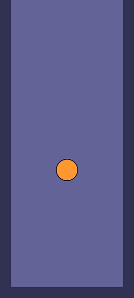

本项目仅仅是一个demo，用来探索用RN开发游戏的可能性，离一个完整的游戏还差的比较远

# 准备：
1. 安装RN开发环境
安装RN的文章资料应该满世界都有，这里就不重复了。

2. 安装expo
```bash
yarn global add expo-cli
```

# 创建：
本文中使用expo创建app，这也是一个趋势。

```bash
expo init ballcap
```


选择第一项blank


完成


新创建的工程目录如下：
```txt
.
├── .expo
├── .expo-shared
├── .git
├── .gitignore
├── App.js
├── app.json
├── assets
│   ├── adaptive-icon.png
│   ├── favicon.png
│   ├── icon.png
│   └── splash.png
├── babel.config.js
├── node_modules
├── package.json
├── project.txt
└── yarn.lock
```
比传统的RN工程要简单很多。

# 运行

执行下面的命令：

```bash
yarn android
```
你将会看到一个硕大的二维码：


手机上用expo扫描二维码即可在手机上运行app，如图：


到此为止我们的准备工作已经就绪可以愉快的玩耍了。

# 开发：

## 引入游戏引擎：RNGM

### 安装npm: react-native-game-engine
```bash
yarn add react-native-game-engine
```

### 修改App.js
修改前：
```js
import { StatusBar } from 'expo-status-bar';
import React from 'react';
import { StyleSheet, Text, View } from 'react-native';

export default function App() {
  return (
    <View style={styles.container}>
      <Text>Open up App.js to start working on your app!</Text>
      <StatusBar style="auto" />
    </View>
  );
}

const styles = StyleSheet.create({
  container: {
    flex: 1,
    backgroundColor: '#fff',
    alignItems: 'center',
    justifyContent: 'center',
  },
});
```

修改后：
```js
import { StatusBar } from 'expo-status-bar';
import React from 'react';
import { StyleSheet, Text, View } from 'react-native';
// 添加游戏引擎1/2
import { GameEngine } from "react-native-game-engine";

export default function App() {
  // 添加游戏引擎2/2
  return (
    <GameEngine style={styles.container}>
      <StatusBar hidden={true} />
    </GameEngine>
  );
}

const styles = StyleSheet.create({
  container: {
    flex: 1,
    backgroundColor: '#fff',
  },
});

```

此时reload你的app，你会发现整个世界清净了：

“此处省略全白截图一张”

## 添加物体

结束空空荡荡的状态

### 添加Ball

新建Ball.js:
```js
import React, { Component } from "react";
import { View } from "react-native";
import { array, object, string } from 'prop-types';

export default class Ball extends Component {
  render() {
    const width = this.props.size[0];
    const height = this.props.size[1];
    const x = this.props.body.position.x - width / 2;
    const y = this.props.body.position.y - height / 2;
    const minSize = Math.min(width, height);
    return (
      <View
        style={{
          position: "absolute",
          left: x,
          top: y,
          width: width,
          height: height,
          backgroundColor: this.props.color || "orange",
          borderWidth: 2,
          borderRadius: minSize / 2,
          borderColor: 'black'
        }} />
    );
  }
}

Ball.propTypes = {
  size: array,
  body: object,
  color: string
}
```
和其他的RN组件没有什么区别，就是简单的将正方形的View加上圆角变成圆。

接下来，修改App.js引入Ball，并添加ball对象：
```js
// ...
import {
  Dimensions,
  // ...
} from 'react-native';
// ...
// 添加Ball 1/2
import Ball from './Ball';
const { width, height } = Dimensions.get("screen");
const ballSize = Math.trunc(Math.max(width, height) * 0.075);
const ball = { position: { x: width / 2, y: height / 2 } };


export default function App() {
  // 添加游戏引擎2/2
  return (
    <GameEngine
      style={styles.container}
      entities={{
        // 添加Ball 2/2
        ball: {
          body: ball,
          size: [ballSize, ballSize],
          color: '#f93',
          renderer: Ball
        }
      }} >
      <StatusBar hidden={true} />
    </ GameEngine>
  );
}
// ...
```

reload效果如图：


### 添加Wall

创建Wall.j添加代码

其实和Ball类似的一个组件：

“此处省略Wall源码29行”

在App.js中 添加Wall

```js
//...
// 添加Walls 1/3
import Wall from './Wall';

const ball = createObject(width / 2, height / 2);

//...
// 添加Walls 2/3
const wallColor = "#335"
const wallSize = ballSize / 4;
const floor = createObject(width / 2, height - wallSize / 2);
const leftwall = createObject(wallSize / 2, height / 2);
const rightwall = createObject(width - wallSize / 2, height / 2);

export default function App() {
  // 添加游戏引擎2/2
  return (
    <GameEngine
      style={styles.container}
      entities={{
        // 添加Ball 3/3
        ball: {
          //....
        },
        // 添加Walls 3/3
        leftwall: {
          body: leftwall,
          size: [wallSize, height],
          color: wallColor,
          renderer: Wall
        },
        rightwall: {
          body: rightwall,
          size: [wallSize, height],
          color: wallColor,
          renderer: Wall
        },
        floor: {
          body: floor,
          size: [width, wallSize],
          color: wallColor,
          renderer: Wall
        }
      }} >
      <StatusBar hidden={true} />
    </ GameEngine>
  );
}
//...

```

效果如图：


## 添加物理引擎Matter

让物体按照物理规律运动

```bash
expo install matter-js poly-decomp 
```
或者
```bash
yarn add matter-js poly-decomp 
```

增加Physics.js
```js
import Matter from "matter-js";

// 创建引擎
const engine = Matter.Engine.create({ enableSleeping: false });
const world = engine.world;
// 引擎对象
export const physicsEntity = {
  engine: engine,
  world: world
};

// 更新引擎
export const Physics = (entities, { time }) => {
  let engine = entities["physics"].engine;
  Matter.Engine.update(engine, time.delta);
  return entities;
};


//创建墙
export const createWall = (x, y, w, h) => {
  const wall = Matter.Bodies.rectangle(x, y, w, h, { isStatic: true })
  Matter.World.add(world, wall);
  return wall;
};

//创建球
export const createBall = (x, y, r) => {
  const ball = Matter.Bodies.circle(x, y, r, { frictionAir: 0.021 });
  Matter.World.add(world, ball);
  return ball;
}
```

修改App.js:
```js
//...

import { Physics, physicsEntity, createWall, createBall } from './Physics';

// const createObject = (x, y) => ({ position: { x: x, y: y } });

// 添加Ball 2/3
const { width, height } = Dimensions.get("screen");
const ballSize = Math.trunc(Math.max(width, height) * 0.075);
const ball = createBall(width / 2, height / 2, ballSize / 2);

// 添加Walls 2/3
const wallColor = "#335"
const wallSize = ballSize * 0.5;
const floor = createWall(width / 2, height - wallSize / 2, width, wallSize);
const leftwall = createWall(wallSize / 2, height / 2, wallSize, height);
const rightwall = createWall(width - wallSize / 2, height / 2, wallSize, height);

export default function App() {
  // 添加游戏引擎2/2
  return (
    <GameEngine
      style={styles.container}
      systems={[Physics]}
      entities={{
        physics: physicsEntity,
        // 添加Ball 3/3
        ball: {
          // ...
        },
        //  ...
      }} >
    </ GameEngine>
  );
}
//...
```

效果如图：




## 添加点击事件

当我们点击屏幕的时候创建一个圆球。

Physics.js中添加CreateBalls
```js
// 点击创建球
let ballIndex = 1;
const ballColors = [ "#f93", "#f39", "#9f3", "#3f9", "#93f", "#39f"];
export const CreateBalls = (renderer)=> (entities, { touches, screen }) => {
  const ballSize = Math.trunc(Math.max(screen.width, screen.height) * 0.075);
  
  touches.filter(t => t.type === "press").forEach(t => {
    entities[++ballIndex] = {
      body: createBall(t.event.pageX, t.event.pageY, ballSize / 2),
      size: [ballSize, ballSize],
      color: ballColors[ballIndex % ballColors.length],
      renderer: renderer
    };
  });
  return entities;
};

```

App.js中添加

```js
//...
import {
  //...
  createBall,
  CreateBalls
} from './Physics';

// ...
export default function App() {
  // 添加游戏引擎2/2
  return (
    <GameEngine
      systems={[Physics, CreateBalls(Ball)]}
      entities={{
        //...
      }} >
      <StatusBar hidden={true} />
    </ GameEngine>
  );
}
//...

```

## 添加重力传感器

```bash
expo install expo-sensors
```

如果不用expo可以添加 react-native-sensors，用法大同小异

修改Physics.js
```
//...
import { useState, useEffect } from 'react';
import { Accelerometer } from 'expo-sensors';
//...
export const useAccelerometer = () => {
  const [subscription, setSubscription] = useState(null);
  const subscribeAccelerometer = () => {
    setSubscription(
      Accelerometer.addListener(accelerometerData => {
        const { x, y, z } = accelerometerData;
        world.gravity.x = -x;
        world.gravity.y = y;
      })
    );
  };

  const unsubscribeAccelerometer = () => {
    subscription && subscription.remove();
    setSubscription(null);
  };

  useEffect(() => {
    subscribeAccelerometer();
    return () => unsubscribeAccelerometer();
  }, []);
} 
```

修改App.js 调用useAccelerometer
```js
// ...
import {
  // ...
  CreateBalls,
  useAccelerometer
} from './Physics';
// ...
export default function App() {
  useAccelerometer()
  // 添加游戏引擎2/2
  return (
    <GameEngine>
    //...
    </ GameEngine>
  );
}

```

现在你可以通过调整手机角度来改变重力方向了，效果如图：


# 参考资料：
[My Journey with React Native Game Engine Part I: Starting the Project](https://medium.com/@williamyang93/my-journey-with-react-native-game-engine-part-i-starting-the-project-bbebcd2ccf6)

[My Journey with React Native Game Engine Part II: Adding Touch and Bounce](https://medium.com/@williamyang93/my-journey-with-react-native-game-engine-part-ii-adding-touch-and-bounce-b9ae3fac06b9)

[expo accelerometer](https://docs.expo.io/versions/v40.0.0/sdk/accelerometer/)

# 源码地址

https://github.com/caojianfeng/ballcup